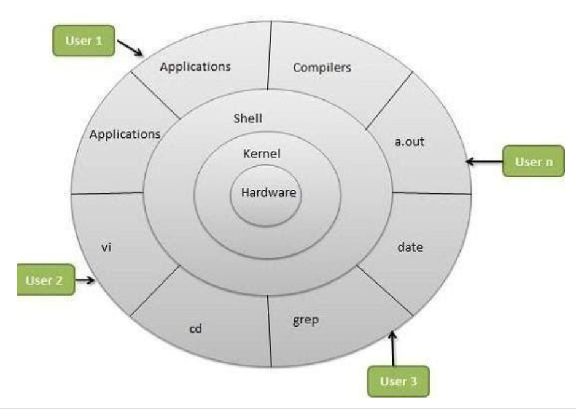
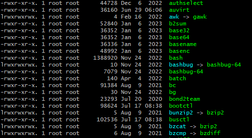
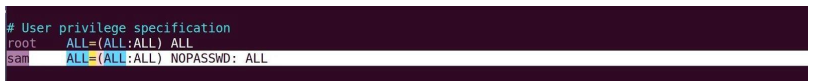

# DevOps courses: DevOps Beginners to Advanced + 20 Real Time Projects
(Note: this is a personal note)
## Introduction
### Software Development Lifecycle (SDLC)
1. Requirement Gathering
2. Planning
3. Designing
4. Development
5. Testing
6. Deploying and Maintaining

#### Models in SDLC
- Waterfall
- Agile
- Spiral
- Big Bang
- etc.

### DevOps
- collaboration
- Communication
- Integration (automation)

### DevOps Lifecycle
1. Code - Developers commits code
2. Code Build - Deployable software: Artifact
3. Code Test - Unit and Integration test
4. Code Analysis - Vulnerability, best practices
5. Delivery - Deploy changes to staging
6. DB/Sec CHanges - Every other ops changes
7. Software Testing - QA/Functional, load, performance tests
8. Deploy to Prod
9. Go Live - User traffic diverted to new changes
10. User Approval - User Feedback
11. Keep Monitoring

### Continuous Integration
Continuous integration is a DevOps software development practice where developers regularly merge their code changes into a central repository, after which automated builds and tests are run.
- Continuous integration is an automated process in DevOps. Which generates software and its features quickly and efficiently
- Bad process: Developers write several lines of code while creating a software. It's an ideal practice to store all this code at a centralized place. The centralized repository is called a version control system like GitHub. Everyday developers will pull and push code such repositories several times in a day. Co code changes or code commit happens continuously. The code will be moved to build server. On the build server, the code will be built, tested, and evaluated -> generate the software (called it as artifact at this stage) -> The artifact will be stored in a software repository. Artifact is an archive of files generated from the build process. Based on the programming language, the artifact will be packaged in a specific format (WAR/JAR in Java, DLL/EXE/MSI in Windows or even ZIP/TAR) -> Shipped to servers for further testing -> once the testers approve, it can be shipped to production servers. -> The huge amount of code can cause many serious errors/problems -> A lot of reworks -> Code is merged but not integrated
- Solution: After every single commit from developers, the code should be built and tested automatically (automated process), so no waiting and collecting all these codes with bugs. As soon as the developers receives a failed notification, they will fix the code and commit it again -> if it's good, then the code can be versioned and stored in a software repository.
- Lifecycle: Code -> Fetch -> Build -> Test -> Notify -> Feedback -> Code -> ... called as Continuous Integration Process (CI)
- Goals of CI are to detect effects in the very early stage, so it does not multiply
#### Tools
- IDE (Atom, Eclipse, VSCode,...) for coding. IDE will be integrated with version control system (GIT, SVN, TFS, PERFORCE, ...)
- Build Tools based on the programming language
- Software Repository: to store artifacts
- CI Tools: JENKINS, CIRCLECI, TEAMCITY, BAMBOO CI, CRUISE CONTROL, ...

### Continuous Delivery
Continuous delivery is a software development practice where code changes are automatically prepared for a release to production
#### Deployment
- Server provisioning
- Dependencies
- Config changes
- Network
- Artifact deploying
- etc.

Ops team will be flooded with such requests as CI process will generate faster and regularly in a Agile SDLC -> too much of human intervention and manual approval -> All steps in deployment process need to be automated -> Continuous Delivery

#### Tools
- ANSIBLE, PUPPET, CHEF for system automation
- TERRAFORM, CFORMATION for cloud infrastructure
- JENKINS, OCTOPUS DEPLOY for CI/CD automation

#### Test automation
- Functional
- Load
- Performance
- Security
- DB
- Any other test cases

### Combination
- Ops teams will write automation code for deployment
- Testers will write automation code for software testing
- Sync the automation codes with developer's source code.

-> Integrate CI from DEV teams, automate deployment from Ops teams, and automate testing from QA teams

## Prerequisites Info and Setup
### Chocolatey for Windows
- This tool is used to install softwares through command line
- Installation: https://chocolatey.org/install
- After that, we can install packages we want: https://community.chocolatey.org/packages

### Homebrew for MacOS
- Installation: https://docs.brew.sh/Installation
- Search for packages: https://brew.sh/

### Required softwares
We can install one favorite editor or all
#### Windows
- Virtualbox: `choco install virtualbox -y`
- Vagrant: `choco install vagrant -y`
- Git: `choco install git -y` 
- Corretto11jdk: `choco install corretto11jdk -y` (windows)
- Maven: `choco install maven -y`
- AwsCLI: `choco install awscli -y`
- intellijidea-community: `choco install intellijidea-community -y` 
- VSCode: `choco install vscode -y`
- Sublime Text: `choco install sublimetext3.app -y`

#### MacOS (not for M1/M2)
- Execute commands: `echo -k > ~/.curlrc` and then `cat ~/.curlrc`
- Virtualbox: `brew install --cask virtualbox `
- Vagrant: `brew install --cask vagrant`
- Vagrant Manager: `brew install --cask vagrant-manager`
- Git: `brew install git`
- OpenJDK: `brew install openjdk` and then `sudo ln -sfn $HOMEBREW_PREFIX/opt/openjdk@11/libexec/openjdk.jdk /Library/Java/JavaVirtualMachines/openjdk.jdk`
- Maven: `brew install maven`
- AwsCLI: `brew install awscli`
- intellijidea-community: `brew install --cask intellij-idea`
- Intellijidea-ce: `brew install --cask intellij-idea-ce`
- VSCode: `brew install --cask visual-studio-code`
- Sublime Text: `brew install --cask sublime-text`

#### Ubuntu
- Virtualbox: `sudo apt update`, then `sudo apt install virtualbox`
- Vagrant: `curl -O https://releases.hashicorp.com/vagrant/2.2.9/vagrant_2.2.9_x86_64.deb` (or other newer/stable version), then `sudo apt install ./vagrant_2.2.9_x86_64.deb`
- Git: `apt install git`
- JDK: `sudo apt-get install openjdk-8-jdk` (or other stable version)
- Maven: `sudo apt-get install maven`
- awscli: `sudo apt-get install awscli`
- Intellij community: `sudo snap install intellij-idea-community --classic`
- Sublime Text: `sudo apt update`, then `sudo apt install dirmngr gnupg apt-transport-https ca-certificates software-properties-common`, then `curl -fsSL https://download.sublimetext.com/sublimehq-pub.gpg | sudo apt-key add -`, then `sudo add-apt-repository "deb https://download.sublimetext.com/ apt/stable/"`, finally `sudo apt install sublime-text`

## Virtual Machine Setup
### Introduction
One computer can run multiple OS at the same time parallelly (does job of many computers).
- VMware brought in tools or created tools which could allow one computer to run multiple operating systems. These operating systems are isolated (in isolated environment). Each OS takes a partition of the physical resource of the physical machine. Each virtual machine needs its own OS.
- Server Virtualization is the most common virtualization beside virtualization like network, storage ones.

### Terminologies
- Host OS - The operating system of the physical machine.
- Guest OS - The operating system of the virtual machine.
- VM - Virtual Machine
- Snapshot - A way of taking backup of the virtual machine.
- Hypervisor - The tool or the software that let us do or create virtual machine

#### Types of Hypervisor
- Type 1 - Bare metal operating or a bare metal hypervisor. It runs directly on the physical computer. This is only for production and it won't let us use this computer for other purposes. Eg. VMware esxi, Xen Hypervisor. Type 1 hypervisor can be clustered together so we can distribute our virtual machines on the cluster. So if one of the hypervisors goes down, the other can take or run our virtual machines. Hyper-V from Microsoft is the type-1 hypervisor.
- Type 2 - Runs as a software which we can install on any computer for learning and testing purposes. Eg. Oracle virtualbox, vmware server.

### Setup VMs
Thumb Rule: If you want to automate something, make sure you know how to do it manually

#### Setup VMs manually
1. Prerequisites for windows
- Enable Virtualization in BIOS - the setting can be with different names such as VTx, Secure virtual machine, virtualization based on the hardware
- Disable other windows virtualization such as Microsoft HyperV, Windows Hypervisor platform, Windows Subsystem for linux, Docker Desktop, Virtual Machine Platform
- Sometimes the VMs do not get IP address, we may have to: Power off our computer -> Reboot the Router -> Power on our computer

2. Setup
- Open Oracle VM VirtualBox
- Create VM: click `New` -> enter a name -> Type `Linux` for Linux VM or `Ubuntu` for UbuntuVM -> Version `Red Hat (64-bit)` (linux) or `Ubuntu (64-bit)` for Ubuntu -> allocate memory and CPUs (1 CPU for Linux and 2 CPUs for Ubuntu)
- Install OS: search for an OS (CentOS or Almalinux 9 ([link](https://repo.almalinux.org/almalinux/9/isos/x86_64/) and download `AlmaLinux-9.2-x86_64-boot.iso` file) ISO file or [ubuntu-link](https://releases.ubuntu.com/jammy/)) -> in VirtualBox, select the newly created Linux VM -> Setting -> Storage -> Click on the `Empty` of the `Controller: IDE` -> find the dropdown of the Attributes/Optical Drive -> `Choose a disk file...` -> Select the newly downloaded ISO file -> Check the `Live CD/DVD` -> Go to the `Network` tab -> select `Adapter 2` -> `Enable Network Adapter` -> `Attached to: Bridged Adapter` -> Name of the LAN/Wireless Controller/Adapter -> OK -> `Start` the VM -> start the installation process. Note: for `ubuntu`, follow the default option of steps, but make sure to enable `SSH` in one of the step.
- Make sure to remove the installation ISO file
- Type `ip addr show` to get the bridge adapter IP address in the Linux terminal
- In the GitBash of the host machine, type `ssh <linux username>@<bridge adapter IP address>` to add the IP permanently to the list of host and login into the created Linux OS from the host machine (type `exit to exit`).

3. VM management problem
- OS installation that we need to go through while installing OS on a VM
- Time consuming
- Manual => Human Errors
- Tough to replicate multi VMs
- Need to document entire setup

#### Setup VMs automatically
##### Vagrant
- Vagrant is a VM automation tool. It manages/automates VMs lifecycle such as creating, making changes and cleaning up.
- It is not a replacement of any hypervisor like VMware or Oracle VM VirtualBox. It is on top of that.
- No OS installation because Vagrant uses VM Images/Boxes that are available on Vagrant cloud.
- Base on the VM boxes, we can create as many VMs as we want
- All VM settings will be in a filed called `Vagrantfile`. We can manage all VM settings in the file like RAM, CPU, IP addresses. We can also do provisioning (means when the OS is completely booted, we want to execute some commands on it like setting up some servers, web servers, database servers, or anything)
- Simple commands like `vagrant init <boxname>`, `vagrant up`, `vagrant ssh`, `vagrant halt`, `vagrant destroy`.

##### Vagrant Architecture
- Create a vagrant file -> run `vagrant up` -> Vagrant reads the `Vagrantfile` -> if the box is available in our local machine, it will take it, otherwise, it will download the image from Vagrant Cloud -> Contact the Hypervisor (Oracle Virtualbox/VMware working station etc...) and give the information of creating the VM -> the VM will be created.

##### Step to create VMs with Vagrant
- Create a folder in the physical computer
- Create a `Vagrantfile` in the created folder
- Issue the command `vagrant up`
- Use `vagrant ssh` to login into the VM
- Use `vagrant halt` to power off or `vagrant destroy` to delete the VM
- Note: MacOS M1/M2 does not work with Oracle Virtualbox, so we have to use `VMware Fusion`

##### Exercise
- Open `Git Bash` for Windows or Mac OS Terminal
- Create a folder in an appropriate path: `mkdir /f/Studies/DevOps/<folder name>`
- Enter the created folder: `cd /f/Studies/DevOps/<folder name>`
- Create VM folders: `mkdir centos`, `mkdir ubuntu`, etc.
- Enter a VM folder: `cd centos`
- Go to [Vagrant Cloud app](https://app.vagrantup.com/boxes/search) to get a box if we don't have. Exp. find [Centos](https://app.vagrantup.com/eurolinux-vagrant/boxes/centos-stream-9), copy the name (`eurolinux-vagrant/centos-stream-9`) or [Ubuntu Jammy](https://app.vagrantup.com/ubuntu/boxes/jammy64) for `ubuntu/jammy64`
- Enter to the VM folder GitBash (here `centos`), type `vagrant init eurolinux-vagrant/centos-stream-9`. To view the newly created  `Vagrantfile`, use `vat Vagrantfile`. If we realize that we got the wrong box after the file created, we can go to the line `config.vm.box = "eurolinux-vagrant/centos-stream-9"` to change the box name
- Run `vagrant up`. If we get an error like `Error: schannel: next InitializeSecurityContext`, make sure to disable the antivirus, disconnect VPN or if you are in a corporate network, make sure you are using some other internet and try again `vagrant up`
- We can run `vagrant box list` to see the downloaded boxes. `vagrant status` to check if any VM is running or not in the current folder or `vagrant global-status` for all running VMs. If you are using VirtualBox as the Supervisor, you can see the box is running when you open the Oracle VM VirtualBox Manager
- To login into the VM, we run `vagrant ssh`. We can use `sudo -i` to switch to the root user if we need to.
- use `vagrant halt` to power off the VM or `vagrant reload` to reboot the VM (Vagrant will look through the `Vagrantfile` to see if any changes and apply them. If we change the box name, we need to delete the VM using `vagrant destroy`)

## Linux
Open source software is the software with source code that anyone can inspect, modify, and enhance.

Linux is an open-source operating system/kernel
### Introduction
#### Principles
- Everything is a file (including hardware - mouse, keyboard, printer, etc.)
- Small single purpose programs  (no bulky programs, or rally)
- Ability to chain programs together for complex operations
- Avoid Captive User Interface (we don't like the graphical software, otherwise it will be difficult to run things in the background or automate such things)
- Configuration data stored in text file (so we can easily make changes to the files)
#### Why Linux?
- Open source
- Community Support
- Support wide variety of hardware (computers, laptops, servers, etc.)
- Most servers runs on Linux
- Automation (easier to do on Linux than on other OS like Windows)
- Linux is considered as a secure operating system

#### Architecture of Linux

- Linux Kernel which read or understand the hardware and can pass signals through to and from the hardware to Shell
- From Shell we can execute commands and expect returns
- We also have a lot of tools built around the Linux kernel starting from simple commands like `cd`, `vi`, `grep` to graphical softwares like browsers, PDF readers

#### Popular Linux distributions
- Popular Desktop Linux OS: Ubuntu Linux, Linux Mint, Arch Linux, Fedora, Debian, OpenSuse, etc.
- Popular Server Linux OS: Red Hat Enterprise Linux (most stable and secure Linux OS, but not open source), Ubuntu Server, Centos, SUSE Enterprise Linux, Amazon Linux, etc.

##### Most used Linux distributions currently in IT industry:
- RPM based: Red Hat Enterprise Linux, Centos, Oracle Linux, Amazon Linux
- Debian based: Ubuntu Sever, Kali Linux
- What are the distinctions between RPM-based and Debian-based systems? From a user's perspective, there aren't significant differences between these two systems. RPM (Red Hat Package Manager) and DEB (Debian) formats are essentially both archive files with attached metadata. They share similarities in their complexity, reliance on hardcoded installation paths, and only exhibit subtle variations. DEB files serve as installation packages for Debian-based distributions, while RPM files are used for Red Hat-based distributions. For instance, Ubuntu utilizes Debian's package management system, relying on APT and DPKG, whereas Red Hat, CentOS, and Fedora use the older RPM-based package management system originally developed by Red Hat Linux.
- DEB or .deb (Debian based softwares) is the extension of the Debian software package format and the most often used name for such binary packages. DEB was developed by Bedian. Exp. we can install Google Chrome using `dpkg -i google-chrome-stable_current_amd64.deb`
- RPM, short for Red Hat Package Manager, is a comprehensive package management system associated with Red Hat-based software. The term 'RPM' can refer to multiple aspects, including the .rpm file format, files packaged in this format, software distributed within these packages, and the package manager software itself. RPM was originally designed for Linux distributions and serves as the fundamental package format adhered to by the Linux Standard Base. It was jointly developed by the Linux community and Red Hat. Exp. we can install Google Chrome using `rpm -ivh google-chrome-stable-57.0.2987.133-1.x86_64.rpm`

### Directories in Linux
- Home Directories: `/root`, `/home/username`
- User Executables: `/bin`, `usr/bin`, `/usr/local/bin`
- System Executables: `/sbin`, `usr/sbin`, `/usr/local/sbin`
- Other Mountpoints (external devices such as USB): `/media`, `/mnt`
- Configuration: `/etc`
- Temporary Files: `/tmp`
- Kernels and Bootloader: `/boot`
- Server Data (eg. running website files, SQL directories): `/var`, `/srv`
- System Information: `/proc`, `/sys`
- Shared Libraries: `/lib`, `/usr/lib`, `/usr/local/lib`

### Common Commands in Linux
`<command> <options> <arguments>`; `<command> --help` to check all the options of the command
- `whoami`: what user we are
- `pwd`: current working directory
- `ls -<options>`: list of all files and folders in the current directory (options: `l` - long listing format, one per line; `a` - list all hidden started with `.`; `F` - add a `/` classification at the end of each directory; `g` - list all with the group name; `i` - print index number of each; `m` - list all separated by comma `,`; `n` - list numeric `UID` and `GID` of owner and groups; `r` - list all in reverse order; `R` - short list all directories; `t` - sorted by modified time, started with the newest file)
- `cat <path to file>/<filename`: read a file. Exp. `cat /etc/os-release` to read the release note and version info of the OS
- `sudo -i`: switch to superuser
- `cd <path to a directory>`: go to a directory. If we do `cd /` -> enter the root directory. `cd` alone or `cd ~` will bring we back to the home directory (`/root` for superuser and `/home/<username>` for the current user)
- `clear` or ctrl + l: clear the terminal screen
- `uptime`: read the information on the uptime of the OS
- `free -m`: check information of the free memory
- `exit`: if root user -> logout and go back to the current logged user. if user -> back to our physical OS
- `mkdir <directory> <another directory> ...`: create one or more directories in the current directory. If we create a directory with an absolute path and some parts of the path do not exit, we need to add `-p` option to automatically create corresponding directories if not existed.
- `touch <filename>.<extension> ...`: create a new file or more in the current directory. We can also create multiple file using `touch afile{1..10}.txt` to create 10 txt files (afile1.txt, afile2.txt, ..., afile10.txt)
- `cp <file-to-copy> <path-to-destination>`: copy a file to a new directory. We can copy a file with absolute path (exp. `cp /home/vagrant/devfile.txt /home/vagrant/dev/`).
- `cp -r <directory or absolute-path> <path-to-destination>`: copy a directory to a directory
- `mv <file or file-with-absolute-path> <path-to-destination>`: move a file to a directory
- `mv <directory or absolute-path> <path-to-destination>`: move a directory to a directory
- `mv <old-filename/directory> <new-filename/directory`: we can use `mv` to rename a file or directory
- use regular expression. exp. `mv *.txt textdir/` (`*` for everything)
- `rm <filename>`: remove a file
- `rm -r <directory>`: remove a directory
- `rm -r *`: remove everything in the current directory or with `-rf` to force removal
- `history`: see all commands that have been executed
- `ln -s <original-file-path> <link-file-path>`: create a link/shortcut of a file to the destination folder (to remove the link we can use `rm` or `unlink` command)
- `wc -l <file>`: counts the number of lines in a file
- `find <path> -name <keyword>`: find in a directory (with path) all files in which their name contains the "keyword". There are other options such as `inum` - for searching a file with particular inode number; `type` - for searching a particular type of file; `-user` - for files whose owner is a particular user; `-group` - for files belonging to particular group
- `tree <directory path>`: to see directory structure in tree format

### Vim Editor
#### Installation
- inside the VM, execute `sudo yum install vim -y`
#### Modes
- Command Mode (default)
- Insert mode (edit mode - by hitting the `I` when in the Command mode; `o` to start at the next line; hitting `ESC` to escape the mode)
- Extended command mode (other operations such as saving, quitting - by hitting the `:` when in the Command mode, and type `w` for writing/saving, `q` for quitting the mode or exit the Vim editor; or `wq` to save and quit at the same time)
#### Basic operations
- `vim <filename>.<extension>`: to create a file or open an existing file. Exp: `vim firstfile.txt`

In extended command mode (`ESC` + `:`):
- `w` (`:w`): to save/write
- `q` (`:q`): to quit/escape
- `wq` (`:wq`): to save and quit at the same time
- `wq!`: to save and quit forcefully
- `q!` (`:q!`): to discard forcefully
- `w!`: to save forcefully
- `x`: to save and quit
- `X`: to give password to the file and remove password
- `n`: to go to line no. `n`
- `se nu`: to set the line numbers to the file
- `se nonu`: to remove the set line numbers

In command mode:
- `gg`: to go to the beginning of the page
- `G`: to go to the end of the page
- `w`: to move the cursor forward, word by word
- `b`: to move the cursor backward, word by word
- `nw`: to move the cursor forward to n words (SW)
- `nb`: to mve the cursor backward to n words (SB)
- `u`: to undo the last change (word)
- `U`: to undo the previous change (entire line)
- Ctr + `R`: to redo the changes
- `yy`: to copy a line
- `nyy`: to copy n lines (Syy or 4yy);
- `p`: to paste line below the cursor position
- `P`: to paste line above the cursor position
- `dw`: to delete the word letter by letter (like backspace)
- `x`: to delete the word letter by letter (like DEL key)
- `dd`: to delete or cut entire line
- `ndd`: to delete or cut n number of lines from cursor position
- `/`: to search for a word in the line (`n` to go to the next search)

### Types of files in Linux
When we do `ls -l` to get long list of files and directories, one per line, we will see in each line with the following format `<first-character><permissions>...`. Base on the first character we can know the type of the files (directories are considered as files too)


- `-` (Regular file): normal files such as text, data, or executable files
- `d` (Directory): files (directories) that are lists of other files
- `l` (Link): a shortcut that points to the location of the actual file
- `c` (Special file): Mechanism used for input and output, such as files in `/dev`
- `s` (Socket): a special file that provides inter-process networking protected by the file system's access control
- `p` (Pipe): a special file that allows processes to communicate with each other without using network socket semantics
- `b` (Block/Hard disk): a block file
 
 We can find a file type using `file <filepath>`

 ### Filter & Input/Output (IO) redirection command
 #### `grep`
 - `grep` command is used to find texts from any text input.
 - Exp. we can find line which contains word as "root" from the `/etc/passwd` file (contains information about all the users in the system) using `grep root /etc/passwd` (note that Linux is case sensitive, to ignore case add `-i` option).
 - If we want to look for a text in the entire current directory we can do `grep -i hello-world *`
 - also look into all sub-directories `grep -iR hello-world *`.
 - We can also show all content that does not contain a text using `grep -vi firewall <filename>`.

 #### `less`
 - helps to display file content page wise or line wise (like `Vim` but is used for reading the content only with some options)
 - Exp: `less /etc/passwd`
 - press `Enter` key to scroll down line by line
 - use `d` to go to next page
 - use `b` to go to the previous page
 - use `/` to search for a word in the file
 - use `v` to go vi mode where you can edit the file and oce you save it, you will back to `less` command

 #### `more`
 - exactly same like `less`
 - with percentage to indicate the amount of the hidden content

#### `head`
- see the first few lines of a file (10 lines by default)
- Exp: `head /etc/passwd`
- `head -20 /etc/passwd`: to show the first 20 lines of the file

#### `tail`
- see the last few lines of a file (10 lines by default)
- Exp: `tail /etc/passwd`
- `tail -20 /etc/passwd`: to show the last 20 lines of the file
- we can use `-f` option to show the dynamic content tracking any changes. For troubleshooting, it is good to read log files. We can use `CTRL` + `c` to quit the mode

#### `cut`
- used to extract specific columns or fields from lines of text files.
- `cut OPTION... [FILE]...`
- to delimit spaces and print the field in the case the content have proper separator or delimiter like `:`, `;`, `/`, `,`, etc.
- `-f FIELDS`: specify the fields (columns) to cut. Fields are separated by a delimiter (by default, it's a tab character)
- `-d DELIMITER`: specify the delimiter that separated fields. By default, it's a tab character
- Exp: `cut -f 1,3 file.txt` = extracts the 1st and 3rd columns from `file.text` and displays the result
- Exp2: `cut -d ',' -f 2,4 data.csv` = extracts the 2nd and 4th columns from a CSV file using a comma as the delimiter
- Exp3: `cut -b 1-4 binary_file` = cuts the first 4 bytes from a binary file
- Exp4: `cut -f 1-3,5- file.txt` = extracts fields 1 through 3 and field 5 from file.txt
- Exp5: `cut -c 1,3- file.text` = displays all characters from file.txt except for the 2nd character

#### `sed`
- `sed` stands for stream editor, which is used to search a word in the file and replace it with the word required to be in the output
- it will only modify the output, but there will be no change in the original file.
- `sed 's/<search-for>/<replace-with>/g' <filename>`
- Exp: `sed 's/Tech/Technologies/g' ktfile`
- we need to use option `-i` to actually change the file: `sed -i 's/Tech/Technologies/g' ktfile`
- we can do the same thing in Vim: `:%s/Tech/Technologies` (if the text appears multiple times in the same line, it will replace only the first appearance). We can use `g` for globally to replace everything that matches `:%s/Tech/Technology/g`

#### Redirection 
##### Output redirection (using `>` symbol)
- It is used when we want to write/redirect the output to another file. If the file does not exit it creates the file, if it does, it overrides the content of the file
- `command options arguments > file_destination`
- Exp. `uptime > /tmp/sysinfo.txt`
- If we want to append, we use double arrows: `command options arguments >> file_destination`
- If we print noting to a file. the file will have nothing: `cat /etc/null > /temp/sysinfo.txt`
- If we don't want to throw an error in the terminal but print it to a file: `freeeeeee -m 2> /temp/error.log`; `2` means standard error. `1` as default for standard output
- If we want to redirect any kinds of outputs, we can use `&`: `free -m &>> /temp/error.log`

##### Input redirection (using `<` symbol)
- you may want a file to be the input for a command that normally wouldn't accept a file as an option.
- Exp: `cat < filename.txt`: displays the contents of `filename.txt` using the `cat` command
- Exp2: `grep "pattern" < data.txt`: searches for the "pattern" in the file `data.txt`
- Exp3: `cat < file1.txt < file2.txt`: concatenates the contents of `file1.txt` and `file2.txt` and displays the result using the `cat` command
- Exp4: `cat filename.txt | grep "pattern" | sort`: reads the contents of `filename.txt` with `cat`, then uses `grep` to search for a pattern, and finally sorts the results
- Exp5: `./interactive_program < input.txt`: runs the `interactive_program` and provides it with the input form `input.txt` as if the user had entered it.
- Exp6: we can use input redirection to read input from a file instead of from the terminal. The `input.txt` contents will be used as input to the `while` loop
```bash
# script.sh
while read line; do
    echo "Line: $line"
done < input.txt
```
- If we can to pipe multiple command, we use `|`; exp. `ls | wc -l`, `ls | grep host` to search for filenames that contain "host" from the `ls` output; `tail -20 /var/log/messages | grep -i vagrant` to get the last 20 lines from the messages file and then find lines that contains `vagrant` word.

###  Users and Groups
- Users and groups are used to control access to files and resources

#### Introduction
- Users login to the system by supplying their username and password
- Every file on the system is owned by a user and associated with a group
- Every process has an owner and group affiliation and can only access the resources its owner or group can access
- Every user of the system is assigned a unique user ID number (the UID)
- Users name and UID are stored in `/etc/passwd`
- User's password is stored in `/etc/shadow` in encrypted form
- Users are assigned a home directory and a program that is ran when they login (usually a shell)
- Users cannot read, write or execute each other's files without permission
#### Types of users/groups
- Whenever a user is created in Linux things created by default: A home directory (`/home/username`), a mail box (`/var/spool/mail`), unique UID & GID
- Format of user line in a passwd file (`/etc/passwd`): `<username>:x:<userId>:<groupID>:<username>:<homedir>:<shell dir>`; example: `root:x:0:0:root:/root:/bin/bash` or `vagrant:x:1000:1000:vagrant:/home/vagrant:/bin/bash`; where `x` mean `link to shadow file`

| TYPE | EXAMPLE | USER ID | GROUP ID | HOME DIR | SHELL |
| ---- | ------- | ------- | -------- | -------- | ----- |
| ROOT | root | 0 | 0 | /root | /bin/bash |
| REGULAR | hai, vagrant | 1000 to 60000 | 1000 to 60000 | /home/username | /bin/bash |
| SERVICE | ftp, ssh. apache | 1 to 999 | 1 to 999 | /var/ftp etc | /sbin/nologin |

- Super user or root user: the most powerful user as the administrator
- System user or service user: the users created by the softwares or applications. For example if we install Apache, it will create a user apache. These kinds of users are known as system users
- Normal user: the users created by root user. They are regular users like Hai, Liam etc. Only the root user has the permission to create or remove a user
- get info of users: `id <username>`
- add an user: `useradd <username>`; not when we create a user with the username, a corresponding group with group name of username is also created.
- add an user to an existing group: `usermod -aG <group name> <username>`; `-aG` means the supplementary group or the group
- `passwd <username>`: set a password to a user
- `su - <username>`: access/login into other user. If action is perform from the root user, no password is required to enter
- `last`: see users who logged into the system in the past with timestamp
- `who`: see the current logged-in users
- `lsof -u <username>`: list all open files by a particular user (if not install, use `yum install lsof -y`)
- `userdel <username>`: delete a user;
- `userdel -r <username>`: delete a user and its home directory

- Format of group line in group file (`/etc/group`): `<group name>:x:<groupId>:<user1 that belongs to the group>,<user2>,...`; Example: `root:x:0:`, 
- add a group: `groupadd <group name>`
- `groupdel <group name>`: delete a group

### File Permissions
#### Viewing Permissions from the Command-Line
- File permissions may be viewed using `ls -l`
- `ls -l /bin/login` -> `-rwxr-xr-x. 1 root root 19080 sep 16 15:90 /bin/login`
- `r`: permission to read a file or list a directory's contents
- `w`: permission to write to a file or create and remove files from a directory
- `x`: permission execute a program or change into a directory and do a long listing of the directory
- `-`: no permission (in place of the `r`, `w`, or `x`)
- -> `<fileType><3 chars for owner><3 chars for group><3 chars for others>`: `-rwxrwxr-x` -> a regular-typed file in which the owner can read, write and execute, the group can read, write and execute, but the others can only read and execute but not write.

#### Changing file ownership
- Only root can change a file's owner
- Only root or the owner can change a file's group
- Ownership is changed with `chown`: `chown [-R] username file|directory ...`
- Group-Ownership is changed with `chgrp`: `chgrp [-R] group_name file|directory...`

#### Changing Permissions - Symbolic Method
- To change access modes: `chmod [-OPTION] ... mode[,mode] file|directory ...`
- `mode` includes: `u`, `g`, or `o` for user, group, and other; `+`, `-` or `=` for grant, deny or set; `r`, `w`, or `x` for read, write and execute
- `OPTION` includes: `-R` - recursive; `-v` - verbose; `--reference` - reference another file for its mode
- Exp: `chmod ugo+r file`: Grant read access to all (user, group, other) for `file`
- Exp2: `chmod o-wx dir`: Deny write and execute to Other for `dir`
- EXP3: `chmod +x filepath`: give execute permission to all users on the filepath

#### Changing Permissions - Numeric Method
- Uses a three-digit mode number: first digit specifies owner's permissions; second digit specifies group permissions; third digit represent other's permissions
- Permissions are calculated by adding: `4` for read; `2` for write; `1` for execute
- Exp: `chmod 640 myfile` - 6 = 4 (read) + 2 (write) -> owner can read and write, 4 -> the group can read, and 0 -> others can do nothing
- Exp2: `chmod 755 myfile.sh` - 7 = 4 + 2 + 1 -> owner has full permissions, 5 = 4 + 1 -> the group can read and execute but can't write, same to others.

### Sudo
- `sudo` gives power to a normal user to execute commands which is owned by root user
- If a user has already full sudoers privilege, it can become a root user anytime
- `sudo -i`: changes from normal user to root user (only user in the `/etc/sudoers` file or `/etc/sudoers.d` directory can use this command to switch to root user)
- Like a user, a group can also be added into sudoers list.
- We can modify the sudoers list by: `sudo -i` -> `visudo` and change the user/group privilege specification to `ALL`. The sudoers file is `/etc/sudoers`

- Every time we enter `sudo` command, it ask our own password. To turn that off, use `NOPASSWD` in the sudoers file. The line can be like `hai ALL=(ALL) NOPASSWD: ALL`
- If we make an error in the `sudoers` file, the `sudo` commands won't work and only superuser can edit the file after that. For security purposes, servers don't have root password -> problems in running the servers. The better solution (safer) is instead of editing the `sudoers` file, we can go to the `/etc/sudoers.d` directory and create our own file. Like: `cd /etc/sudoers.d` -> `touch <username>` -> enter the file `vim <filename>` -> add `<username> ALL=(ALL) NOPASSWD: ALL`; We can add a group by: `%<group name> ALL=(ALL) NOPASSWD: ALL`

### [Software Management](#software-management)
#### Install a new package
- Go to find the suitable package for the VM OS
- Copy the download link
- Go to the command line and type: `curl <download link> -o <saved filename>`; and then `rpm -ivh <package filename>` to install the downloaded file; exp: `curl https://rpmfind.net/linux/centos/7.9.2009/os/x86_64/Packages/tree-1.6.0-10.el7.x86_64.rpm -o tree-1.6.0-
10.el7.x86_64.rpm` -> `rpm -ivh tree-1.6.0-10.el7.x86_64.rp` where `-ivh` = `i` for install, `v` for verbose, and `h` for human readable format
- If we have problems with failed dependency if the package required other dependencies to be install previously (Linux principle: small and single purpose program), we can use other package managers like `YUM` (for RedHat)

#### Manage packages
- `wget <link>`: download file from a link
- `curl <link>`: access file from a link
- `curl <link> -o <output file>`: access file from a link and store o/p to a file.

##### RedHat PRM commands
- `rpm -ivh <rpm file>`: install the package
- `rpm -Uvh <rpm file>`: upgrade a package
- `rpm -ev <package name>`: Erase/remove an installed package
- `rpm -ev --nodeps <package name>`: erase/remove an installed package without checking for dependencies
- `rpm -qa`: display a list of all installed packages; or `rpm -qa | less`
- `rpm -qi <package name>`: display installed information along with package version and short description
- `rpm -qf </path/to/file>`: find out what package a file belongs to i.e. find what package owns the file
- `rpm -qc <package name>`: display list of configuration files for a package
- `rpm -qcf </path/to/file>`: display list of configuration files for a command
- `rpm -qa --last`: display list of all recently installed RPMs
- `rpm -qpR <.rpm-file>` or `rpm -qR <package>`: find out what dependencies a rpm file has

##### CentOS_8 Commands
- `dnf --help`: show the help
- `dnf search <package>`: search for available repositories
- `dnf install <package> -y`: install the package
- `dnf reinstall <package>`: reinstall a package
- `dnf remove <package>`: remove a package
- `dnf update`: update all packages
- `dnf update <package>`: update a package
- `dnf grouplist`: list all available group packages
- `dnf groupinstall "group name"`: install all the packages in a group
- `dnf repolist`: list enabled dnf repositories
- `dnf clean all`: clean dnf cache
- `dnf history`: view history of dnf
- `dnf info <package>`: show the information of package like version, size, source, repository, etc.

##### YUM Commands
YUM repositories are located at `/etc/yum.repose.d`
- `yum -help`: show the help
- `yum search <package>`: search for available repositories
- `yum install <package> -y`: install the package
- `yum reinstall <package>`: reinstall the package
- `yum remove <package>`: remove a package
- `yum update`: update all packages
- `yum update <package>`: update a specific package
- `yum grouplist`: list all available group packages
- `yum groupinstall "group name>`: install all the packages in a group
- `yum repolist`: list enabled YUM repositories
- `rum install epel-release`: additional package repository that provides easy access to install packages for commonly used software
- `yum clean -all`: clean yum cache
- `yum history`: view history of yum
- `yum info <package>`: show the information of package like version, size, source, repository, etc.

##### Ubuntu20 Commands
Apt repository files are located at `/ect/apt/sources.list` & `/etc/apt/sources.list.d`. Before installing packages in ubuntu with `apt` command, we should run `apt update` to refresh apt repository index
- `apt search <package>`: search for available repositories
- `apt install <package> -y`: install a package
- `apt reinstall <package>`: reinstall a package
- `apt remove <package>`: remove a package
- `apt purge <package>`: remove everything related to the package - clean un-installation
- `apt update`: update all packages
- `apt update <package>`: update a package
- `apt grouplist`: list all available group packages
- `apt groupinstall "group name"`: install all the packages in a group
- `apt repolist`: list enabled apt repositories
- `apt clean all`: view history of apt
- `apt show <package>`: show the information package like version, size, source, repository, etc.
- `apt upgrade`: upgrade all packages
- `apt upgrade <package>`: upgrade a package

#### Services
- `systemctl status <service package>`: shows the status of a service (exp. `httpd` as `systemctl status httpd`)
- `systemctl start <service package>`: starts a service
- `systemctl restart <service package>`: restarts a service
- `systemctl reload <service package>`: reloads a service configuration
- `systemctl enable <service package>`: starts a service at boot time
- `systemctl disable <service package>`: stops a service at boot time
- `systemctl is-active <service package>`: shows whether a service is active or not
- `systemctl is-enabled <service package>`: shows whether a service is enabled or not

#### Processes
- `top`: shows all the dynamic processes based on their consumption
- `ps aux`: similar to `top` but show things on the screen and quit (without watching the processes)
- `ps -ef`: similar to `px aux` without the utilization, but the parent process (`PPID`), which process starts a process. For example: `PPID = 0` for some processes means that these processes were started by the boot (`0`)

- We can use `systemctl` to start a services and its processes
- `kill <PID - process ID>`: kill a process and its child processes
- `kill -9 <PID - process ID>`: forcefully kill a process and its child processes
- To kill multiple processes, we can output those process IDs and use those as inputs to the `xargs kill -9`; Exp: `ps -ef | grep httpd | grep -v 'grep' | awk ' {print $2}' xargs kill -9` -> `ps -ef` for listing all currently running processes with `-e` = lists all processes, `-f` = provides a full listing with more details; `grep httpd` for searching the list of processes generated by `ps -ef` for lines that contain the text `httpd`; `grep -v 'grep'` for filtering out the `grep` process itself from the list because when running `ps -ef | grep httpd`, it also includes a line for the `grep` command; `awk '{print $2}` for extracting the second field (eg. `PID`); `xargs kill -9` for killing all processes with the PIDs

- the best way to remove zombie processes (do not consume resources) is to reboot the machine
- Zombie vs Orphan processes: A child process that remains running even after its parent process is terminated or completed without waiting for the child process execution is called a Orphan process. Zombie process that has completed its task but still, it shows an entry in a process table

#### Archiving
There are many times where we need to archive files and directories. Especially when we want to take its backup or if we have a backup, we want to restore from that.

- `tar -czvf <desired archive filename> <path-to-save-the-archived-file>` (Where `c` = create, `z` = zip or compress, `v` = verbose, `f` = file): to archive a log directory
- Exp: `cd /var/log/` -> `tar -czvf jenkins_06122020.tar.gz jenkins` -> we will the see the tarball file in the `jenkins` directory with the name of `jenkins_06122020.tar.gz`. If we do `file jenkins_06122020.tar.gz` we will see that the file type is `gzip compressed data`

- `tar -xzvf <archived filename>.tar.gz <path-to-extract-the-archived-file>`: extract/restore the archived directory
- Exp: `mv jenkins_06122020.tar.gz /tmp/` -> `tar -xzvf jenkins_06122020.tar.gz jenkins`: the content of the `jenkins_06122020.tar.gz` file will be extracted to the `jenkins` folder within the current directory. We can do `tar -xzvf jenkins_06122020.tar.gz -C /<destination directory/` to extract the file to a desired directory

- use `tar --help` to get more information and options

##### ZIP commands
The `zip` commands are used to simplify the uses of `tar`.
- Install `zip` and `unzip`: `yum install zip unzip -y`

- `zip -r <archived filename>.zip <directory-to-extract>`: `-r` for archiving
- Exp: `zip -r jenkins_06122020.zip jenkins`

- `unzip <archived filename>.zip`: to unzip/extract the archive to the current directory

- more to use like zip/unzip but excluding files, etc. find in `zip/unzip --help`

#### Ubuntu commands (Ubuntu operating system)
Most of Ubuntu commands are the same as of CentOS. However, there are some differences.
- When adding a new user using `useradd <username>`. If we switch to a user using `su - <username>`, it will throw an error `No directory, logging in with HOME=/` or `su: warning: cannot  change directory to /home/<username>: No such file or directory`. So when using `useradd`, it does not create HOME directory for the user. ---> We need to user `adduser` command instead. `adduser <username>`
- When we want to edit the sudo file using `visudo` -> file will be opened in `GNU nano` instead of VIM editor. To use VIM editor as default, we can run `export EDITOR=vim`, that will temporary set the default editor to vim (it will reset when we shut the OS down or reboot it, or logout/login).
- Differences in Software Management, Ubuntu (Debian-based) uses `dpkg` or `apt` instead of `rpm` or `yum`. Checkout [Software Management](#software-management).

## [Vagrant and Linux Servers](#vagrant-linux-servers)

### Vagrant Sync Directory
- A shared folder is mounted to the VM as: `<host folder> => <guest VM folder>`, this means that every changes in the host folder, the directory inside the VM will be also applied to the directory. Make sure to have the host folder exists, the guest directory can be created automatically.
- Applying synced directory is for preserving files incase the VM is aborted or corrupted. We may also want to write scripts or programs in the host machine.
- We can change the synced folder by editing the `Vagrantfile` at the line `config.vm.synced_folder "../data", "/vagrant_data"`. We can change the guest machine path (`/vagrant_data`) to other path like `/opt/scripts` to write some scripts in the VM.
- Synced folder for Windows path: `config.vm.synced_folder "F:\\scripts\\shellscripts",  "/opt/scripts"`
- Synced folder for MacOS path: `config.vm.synced_folder "/Users/hai/Desktop/scripts", "/opt/scripts"`

### Provisioning
Provisioning in Vagrant means executing commands or scripts when the VM comes up first time or if the VM is already running, we can apply provisioning to execute our commands or scripts.
- Provisioning is the process of configuring and deploying an information technology (IT) system resource either locally or in the cloud. In enterprise computing, the term is often associated with virtual machines (VMs) and cloud resource instances.

In a `Vagrantfile`, we may find:
```bash
config.vm.provision "shell", inline: <<-SHELL
    apt-get update
    apt-get install -y apache2
SHELL
```
- where `shell` is a provisioner. There are other provisioners like Ansible, Docker, Chef, Puppet, etc.
- `inline` is where we need to give commands. We can replace it with `script` where we can mention the path of the script
- `<<`: input redirection
- `-SHELL <commands> SHELL`: place to add commands
- Example:
```bash
config.vm.provision "shell", inline: <<-SHELL
    yum install httpd wget unzip git -y
    mkdir /opt/devopsdir
    free -m
    uptime
SHELL
```
- Note no command in provisioning section should be interactive or asking questions. We use `-y` in the above example.
- Provisioning runs only one time when the VM is firstly up (in other technologies, provisioning is called as bootstrapping, meaning after booting the first time, execute the commands on the scripts). If we do `vagrant reload`, there will be no output to be shown. So if the VM is already running or exist (Vm or instance is already created), the commands will not be executed.
- To run the commands in the provision for an existing VM, we need to run `vagrant reload/up --provision`

### Website Setup
- Install `httpd` or `apache2`: `yum install httpd -y`
- install other packages like `wget`, `vim`, `zip`, `unzip`
- Start the `httpd` service: `systemctl start httpd`
- Enable the `httpd` service: `systemctl enable httpd` (to start the service at boot time)

- `html` need to be placed in the `/var/www/html/` directory

Example:
- create an html file: `vim index.html`
- Restart the server: `systemctl restart httpd`

### Wordpress Setup
- Documentation: https://ubuntu.com/tutorials/install-and-configure-wordpress


### Automate Website Setup
- We put all the manual commands into the provisioning section of the `Vagrantfile`
- Infrastructure as code (IaC) is the process of managing and provisioning infrastructure (networks, virtual machines, load balancers, and connection topology) through CODE/Config Files.

Exp:
```bash
config.vm.provision "shell", inline: <<-SHELL
    yum install httpd wget unzip vim -y
    systemctl start httpd
    systemctl enabled httpd
    mkdir -p /tmp/finance
    wget https://www.tooplate.com/zip-templates/2135_mini_finance.zip
    unzip -o 2135_mini_finance.zip
    cp -r 2135_mini_finance/* /var/www/html/
    systemctl restart httpd
    cd /temp/
    rm -rf /tmp/finance
SHELL
```

Or for Wordpress setup
```bash
 config.vm.provision "shell", inline: <<-SHELL
    sudo apt update
    sudo apt install apache2 \
                    ghostscript \
                    libapache2-mod-php \
                    mysql-server \
                    php \
                    php-bcmath \
                    php-curl \
                    php-imagick \
                    php-intl \
                    php-json \
                    php-mbstring \
                    php-mysql \
                    php-xml \
                    php-zip -y
    
    sudo mkdir -p /srv/www
    sudo chown www-data: /srv/www
    curl https://wordpress.org/latest.tar.gz | sudo -u www-data tar zx -C /srv/www
    
    cat > /etc/apache2/sites-available/wordpress.conf <<EOF
<VirtualHost *:80>
  DocumentRoot /srv/www/wordpress
  <Directory /srv/www/wordpress>
      Options FollowSymLinks
      AllowOverride Limit Options FileInfo
      DirectoryIndex index.php
      Require all granted
  </Directory>
  <Directory /srv/www/wordpress/wp-content>
      Options FollowSymLinks
      Require all granted
  </Directory>
</VirtualHost>
EOF
    
    sudo a2ensite wordpress
    sudo a2enmod rewrite
    sudo a2dissite 000-default
    
    mysql -u root -e 'CREATE DATABASE wordpress;'
    mysql -u root -e 'CREATE USER wordpress@localhost IDENTIFIED BY "admin123";'
    mysql -u root -e 'GRANT SELECT,INSERT,UPDATE,DELETE,CREATE,DROP,ALTER ON wordpress.* TO wordpress@localhost;'
    mysql -u root -e 'FLUSH PRIVILEGES;'
    
    sudo -u www-data cp /srv/www/wordpress/wp-config-sample.php /srv/www/wordpress/wp-config.php
    sudo -u www-data sed -i 's/database_name_here/wordpress/' /srv/www/wordpress/wp-config.php
    sudo -u www-data sed -i 's/username_here/wordpress/' /srv/www/wordpress/wp-config.php
    sudo -u www-data sed -i 's/password_here/admin123/' /srv/www/wordpress/wp-config.php
    
    systemctl restart mysql
    systemctl restart apache2
  SHELL
```

### Multi VM Vagrantfile
We can define multiple VMs in a Vagrantfile
```bash
Vagrant.configure("2") do |config|
    # Define the base box for each VM
    config.vm.box = "ubuntu/focal64" # Ubuntu 20.04 for web01 and web02
    config.vm.box_url = "https://vagrantcloud.com/ubuntu/boxes/focal64"
  
    config.vm.define "web01" do |web01| 
        web01.vm.network "private_network", ip: "192.168.56.10"
        web01.vm.hostname = "web01"
    end
  
    config.vm.define "web02" do |web02|
      web02.vm.network "private_network", ip: "192.168.56.11"
      web02.vm.hostname = "web02"
    end
  
    config.vm.define "db01" do |db01|
      config.vm.box = "eurolinux-vagrant/centos-stream-9"
  
      db01.vm.network "private_network", ip: "192.168.56.12"
      db01.vm.hostname = "db01"
  
      # Provisioning for db01
      db01.vm.provision "shell", inline: <<-SHELL
        yum install -y wget unzip mariadb-server
        systemctl start mariadb
        systemct enable mariadb
      SHELL
    end
end
```

Since we have multiple VMs, to login into each VM we use `vagrant ssh <vm-name>`; same for `up`, `destroy`, `halt`, etc. Use `vagrant destroy --force` to destroy all the VMs at once.

## Networking
A Computer Network is a communication between two or more network interfaces. Every device we are using on the network has an IP address assigned to its network interface.

Computer Network contains two or more computers/devices. Internet cables or wireless networks are used to link these computers/devices, each of these is connected to the network interface card (NIC). To connect multiple network interfaces together, routers or softwares called operating systems (OS) are required.
### OSI Model
#### Requirement
- People around the world uses computer network to communicate with each other.
- For worldwide data communication, systems must be developed which are compatible to communicate with each other.
- There should be standard communciation methods or devices

#### OSI Model
- ISO (International Organization of Standardization) has developed this OSI standard.
- This communication model is called as Open System Interconnection (OSI)
- ISO-OSI model is a seven layer architecture developed in 1984
- Layers: 1. Physical (eg. cables); 2. Data link; 3. Network; 4. Transport; 5. Session; 6. Presentation; 7. Application (eg. browsers or apps);

1. The physical layer (lowest layer) in the OSI Model is responsible for the actual physical connection/communication between devices. The information is in `bits` (1s & 0s)
2. The data link layer receives the bit data from the physical one. It is used to facilitate the reliable transmission of data over a physical network medium. The Data Link Layer is responsible for addressing, framing, error detection, and controlling access to the physical medium. It doesn't extend beyond the local network and does not provide end-to-end communication across multiple networks. The data is presented to the Network layer. Data is represented in `frames`
3. The network layer is used to provide routing and forwarding of data between different networks. It enables end-to-end communication across multiple network segments or subnets. The data is essembled in `packets`. The sender's and receiver's IP address are placed in the header by the layer.
4. The Transport layer is used to provide end-to-end communication services for data transfer between two devices or hosts on a network. It ensures that data is reliably and efficiently delivered from the source to the destination while handling issues like data segmentation, flow control, and error recovery. Data is represented in `segments`
5. The Session layer is used to establish, manage, and terminate communication sessions or connections between two devices on a network. It helps coordinate and synchronize data exchange between applications running on different hosts.
6. The Presentation layer is used to handle the translation, encryption, and compression of data for secure and efficient communication between devices. It acts as an intermediary layer between the Application Layer (Layer 7) and the Session Layer (Layer 5).
7. The Application layer is the closest to end-users and is responsible for providing communication services and network services directly to user applications. It interacts with software applications and provides a platform-independent interface for application-level communication across a network.

| OSI Model layer | DoD Model | Protocols | Devices/Apps |
| --------------- | --------- | --------- | ------------ |
| 5, 6 , 7 | application | dns, dhcp, ntp, snmp, https, ftp, ssh, telnet, http, pop3... | web server, mail server, browser, mail client... |
| 4 | host-to-host | tcp / udp | gateway |
| 3 | internet | ip, icmp, igmp | router, firewall layer 3 switch |
| 2 | network access | arp (mac), rarp | bridge layer 2 switch |
| 1 | network access | ethernet, token ring | hub |

- The basic elements of a layered model are: services, protocols, and interfaces:
1. A service is a set of actions that a layer offers to another (higher) layer.
2. A protocal is a set of rules that a layer uses to exchange information.
3. A interface is communication between the layers

#### Exp. Sending - Receiving Letters
- The letter is written, put in an envelop and dropped in mailbox by the sender
- The letter is carried from the mailbox to a post office
- The letter is delivered to a carrier by the post office.
- The letter is delivered from the carrier to the post office.
- The letter is carried from the post office to the mailbox
- The letter is picked up, removed from the envelop, and read by the receiver

#### Exp. Sending - Receiving Data
- The data is inputed/uploaded to the apps/softwares/OS. The send button is clicked.
- The data is processed and transfered through the seven layers starting from layer 7 to layer 2
- The proccessed data will be transfer to the reciever via layer 1
- The proccessed data is re-processed and transfer from layer 2 of the reciever to layer 7
- The data is read by the reciever

### Understanding Networks & IP
#### Classification of network by geography
The distance between device interfaces defines the geography classification

- LAN (Local Area Network): Network interfaces are very close to each other like computers in a room that are connected together through some devices or cables.
- WAN (Wide Area Network): Network interfaces are far away from each other like a computer/cellphone accessing a website that is hosted in somewhere in European data centers. we are accessing that over the internet
- MAN (Metropolitan Area Network): like a metropolitan city that has computers connected in the same network such as Metro trains computer network system.
- CAN (Campus Area Network): like office campus or college campus where we have computers connected together in few acres of land. It is also called as Intranet
- PAN (Personal Area Network): like Bluetool hostpot as our own personal network, which has a very small range.

#### Switches
Switches facilitate the sharing of resources by connecting together all the devices, including computers, printers, and servers, in a small business network. 

Exp: If two nodes (a computer and a printer) need to communicate with each other. The computer sends data to the switch. The switch knows that the computer wants to communicate with the printer. So the switch connects the computer to the printer.

#### Routers
A router receives and sends data on computer networks. Routers are sometimes confused with network hubs, modems, or network switches. However, routers can combine Multiple Networks together. At home, we can have a wifi router, that router can contain a switch so all the devices can communicate with each other. And it can be a modem too.

#### IPv4 Address
IPv4 addresses are in the format of `xxx.xxx.xxx.xxx`. In total, it is 32 bit (8 + 8 + 8 + 8) binary number. An IPv4 address contains 4 octets (1 octet = 8 bits) -> `<1st octet>.<2nd octet>.<3nd octet>.<4th octet>`

- IP has a range from 0.0.0.0 to 255.255.255.255
- We have public IPs for internet communication and private IPs for local network design
- Private IP ranges:
1. Class A: 10.0.0.0 - 10.255.255.255
2. Class B: 172.16.0.0 - 172.31.255.255
3. Class C: 192.168.0.0 - 192.168.255.255

#### Protocols
Protocol in general is a set of rules. In the networking and communication area, a protocol is the formatl specification that defines the procedures that must be followed when transmitting or receiving data. Protocols define the format, timing, sequence, and error checking used on the network.

- TCP protocol:
  -  Reliable Protocol
  - Connection oriented
  - Performs three ways handshake
  - Provision for error detection and retransmission
  - Most applications use TCP for reliable and guaranteed transmission
  - FTP, HTTP, HTTPS
- UDP
  - Unreliable protocol
  - Connectionless
  - Much faster than TCP
  - No acknowledgement waits
  - No proper sequencing of data units
  - Suitable for applications where speed matters more than reliablity
  - DNS, DHCP, TFTP, ARP, RARP

##### Protocols & Port Numbers
The Internet Assigned Numbers Authority (IANA) maintains the [full list](https://www.iana.org/assignments/service-names-port-numbers/service-names-port-numbers.xhtml) of port numbers and protocols assigned to them.
- Ports 20 and 21: File Transfer Protocol (FTP). FTP is for transferring files between a client and a server.
- Port 22: Secure Shell (SSH). SSH is one of many tunneling protocols that create secure network connections.
- Port 25: Historically, Simple Mail Transfer Protocol (SMTP). SMTP is used for email.
-Port 53: Domain Name System (DNS). DNS is an essential process for the modern Internet; it matches human-readable domain names to machine-readable IP addresses, enabling users to load websites and applications without memorizing a long list of IP addresses.
- Port 80: Hypertext Transfer Protocol (HTTP). HTTP is the protocol that makes the World Wide Web possible.
- Port 123: Network Time Protocol (NTP). NTP allows computer clocks to sync with each other, a process that is essential for encryption.
- Port 179: Border Gateway Protocol (BGP). BGP is essential for establishing efficient routes between the large networks that make up the Internet (these large networks are called autonomous systems). Autonomous systems use BGP to broadcast which IP addresses they control.
- Port 443: HTTP Secure (HTTPS). HTTPS is the secure and encrypted version of HTTP. All HTTPS web traffic goes to port 443. Network services that use HTTPS for encryption, such as DNS over HTTPS, also connect at this port.
- Port 500: Internet Security Association and Key Management Protocol (ISAKMP), which is part of the process of setting up secure IPsec connections.
- Port 587: Modern, secure SMTP that uses encryption.
- Port 3389: Remote Desktop Protocol (RDP). RDP enables users to remotely connect to their desktop computers from another device.

#### Networking Commands
- `ifconfig` or `ip addr show`: show information of all active network interfaces
- `ping <ip address>`: Test the connection to an IP. In Linux, the command lines will keep pinging the IP.
- `ping <ip address> -c 4`: we can use `-c 4` option to specify the number of ICMP echo requests to send. Here 4 echo requests.
- We can use a hostname to ping like `ping <hostname>`. To do that, we need a DNS server or specify the IP and hostname in the `/etc/hosts` file. We can add `192.168.40.12 <hostname>`.
- `tracert <domain name>`: Tracing route to a domain with hops. `tracert www.google.com`. We can see where (hops) the request goes throw until it hits the destination. Hops could be a router, DNS server, servers,... This command is used to check the latency between our computer and the target machine. This command may not work in VMs
- `netstat -antp`: show all the TCP open ports in the current machine. We can check the port opened by a service like `netstat -antp | grep <PID - process ID>` (PID can be obtained using `ps -ef | grep <process name>`). Exp: `ps -ef | grep apache2` -> get PID = 3336 -> `netstat -antp | grep 3336` -> get the information of the TCP with the open-port number
- `ss -tunlp`: we can check all the TCP open ports in the current machine with PID information.
- `nmap <target machine>`: show open-ports. Note that we need to install it using `apt install nmap`. This command in some countries is illegal. Use it for troubleshooting only. This is when we are trying to connect two machines together and they are not able to connect because of some issues from some firewall, we can use `nmap` to scan port whether they're open or not.
- `dig <domain>`: DNS lookup. To check if our DNS resolution from our computer is working or not.
- `nslookup <domain>`: older version of `dig`
- `route -n`: show gateways
- `arp`: used to view or add the content to the kernels ARP table (Hardware address table)
- `mtr`: similar to `tracert` but live (in watch mode)
- `telnet <IP Address or Hostname> <port>`: check if a port is open in a machine 

## Introduction to Containers
### What are containers
Containers are a lightweight form of virtualization that allow you to package and run applications and their dependencies in isolated environments called containers. Containers provide a consistent and reproducible way to deploy and manage software across different computing environments, such as development, testing, and production. They have become a popular technology in the world of software development and deployment due to their numerous advantages.
- Containers offer Isolation and not virtualization. For virtualization we can use Virtual Machine. For understanding we can think containers as OS virtualization.

### Whare is Docker
Docker is a platform and a set of tools for containerization, a technology that allows you to package and distribute applications and their dependencies as containers. Docker containers are lightweight, portable, and provide a consistent environment for running applications across different systems, such as development laptops, testing servers, and production environments. Docker has played a significant role in popularizing containerization and has become a standard tool in the world of software development and deployment.
- The isolation and security allows you to run many containers simultaneously on a give host.
- More at [docs](https://docs.docker.com/get-started/)

### Exercise Example of Docker Containers
- Check https://docs.docker.com/desktop/install/ubuntu/ to see how to install Ubuntu
- Create a `Vagrantfile` to automate the installation in a ubuntu virtual machine
```Vagrantfile
Vagrant.configure("2") do |config|
  config.vm.box = "ubuntu/focal64"
  config.vm.network "private_network", ip: "192.168.56.13"
  config.vm.network "public_network"
  config.vm.provider "virtualbox" do |vb|
    vb.memory = "2048"
  end

  # Before you install Docker Engine for the first time on a new host machine, you need to set up the Docker repository. Afterward, you can install and update Docker from the repository: https://docs.docker.com/engine/install/ubuntu/#install-using-the-repository
  config.vm.provision "shell", inline: <<-SHELL
sudo apt-get update
sudo apt-get install ca-certificates curl gnupg -y
sudo install -m 0755 -d /etc/apt/keyrings
curl -fsSL https://download.docker.com/linux/ubuntu/gpg | sudo gpg --dearmor -o /etc/apt/keyrings/docker.gpg
sudo chmod a+r /etc/apt/keyrings/docker.gpg
echo \
  "deb [arch="$(dpkg --print-architecture)" signed-by=/etc/apt/keyrings/docker.gpg] https://download.docker.com/linux/ubuntu \
  "$(. /etc/os-release && echo "$VERSION_CODENAME")" stable" | \
  sudo tee /etc/apt/sources.list.d/docker.list > /dev/null
sudo apt-get update
sudo apt-get install docker-ce docker-ce-cli containerd.io docker-buildx-plugin docker-compose-plugin -y
   SHELL
end
```

- Now we can check if Docker Application Container Engine is running expectedly in the VM using `systemctl status docker` and then `docker run hello-world`.

#### Command examples
- `docker run <docker image name>`: to run a docker image, if that images doesn't exist locally, then Docker Engine will fetch it remotely and run the image
- `docker images`: to check for all the available images in the current system.
- `docker ps`: check all running containers
- `docker ps -a`: show all containers
- `docker run --name <hostname> -d -p <host port>:<container port> <image name>`: `-d` for running in the backgroud; Because docker is isolated and we can't access it from outside. To access, we need to use `-p <host port>:<container port>` for port mapping
- `docker inspect <container name or ID>`:  To see the information of the container
- `docker build`: create a docker image
- `docker stop <container name or ID>`: Stop a running container
- `docker rm <container name or ID>`: Remove a container
- `docker rmi <image ID>`: remove a docker image
