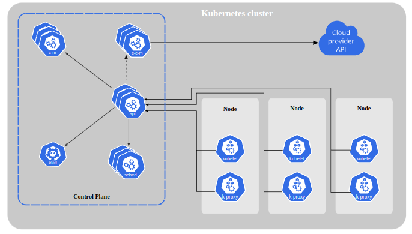
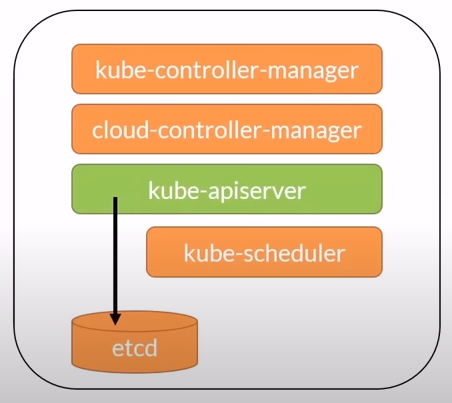
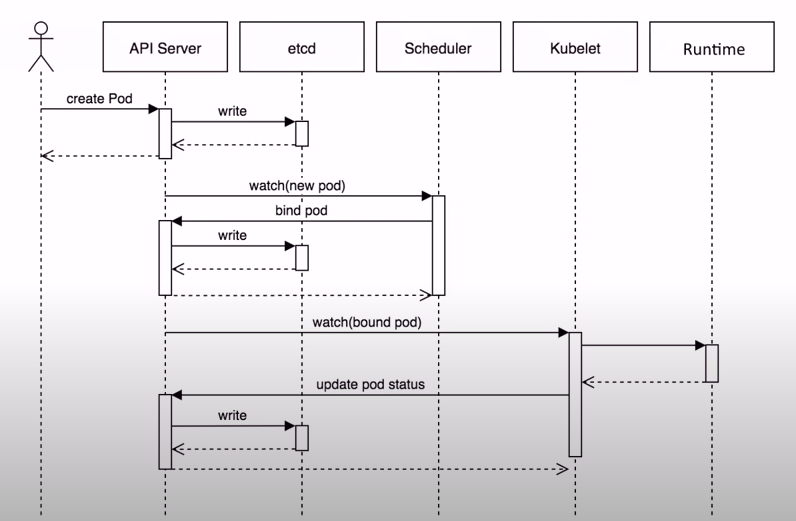
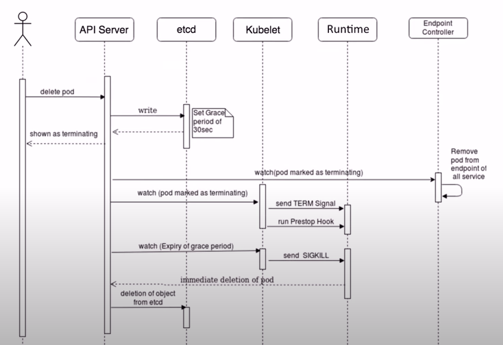
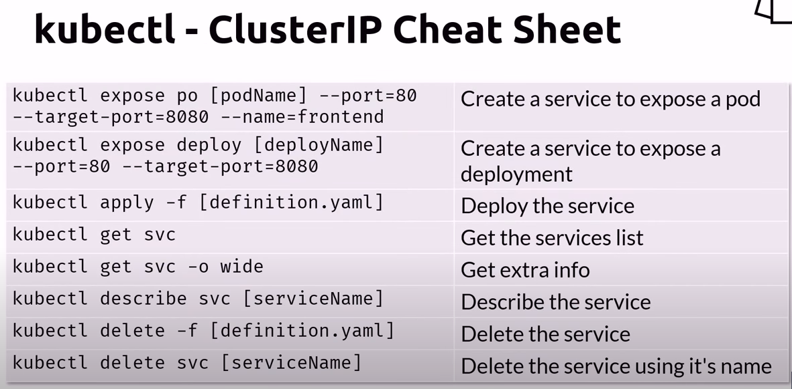
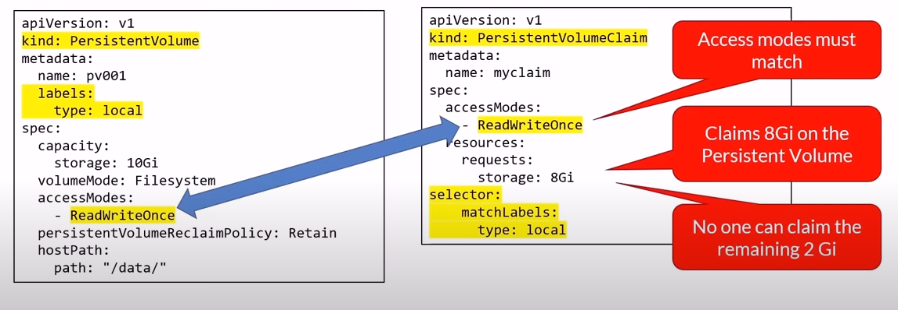
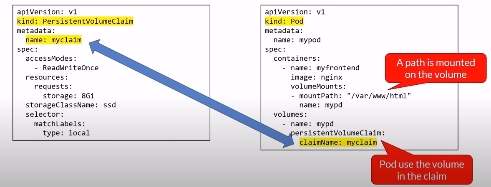

# [Docker Containers and Kubernetes Fundamentals](https://youtu.be/kTp5xUtcalw?si=ytzEYYMqJ5Zs9H0B)

## Microservices Architecture

- A variant of the service-oriented architecture (SOA) structural style - arranges an application as a collection of loosely coupled services.
- In a microservices architecture, services are fine-grained and the protocols are lightweight
- Segregates functionality into smaller separate services each with a single responsibility
- Scales out by deploying each service independently
- Loosely coupled
- Enable autonomous development by different teams, languages and platforms
- Can be written by smaller teams
- Each microservice can own it's own data/database

## Cloud Native

Within a short time, cloud native has become a driving trend in the software industry

- It's a new way to think about building complex systems
- Takes full advantage of modern software development practices, technologies and cloud infrastructure
- Widely popular in the open source communities
- Cloud Native uses containers, service meshes, microservices, immutable infrastructure and declarative APIs
- These techniques enable loosely coupled systems that are resilient, manageable and observable. Combined with robust automation, they allow engineers to make high impact changes frequently and predictably with minimal toil.
- Speed and Agility: users want instantaneous responsiveness, up-to-the-minute features, and no downtime. The business wants accelerated innovation, rapid releases of features to meet description from competitors and increased confidence - stability/performance

Application architecture: Clean code -> Domain Driven Design -> Microservices Principles -> Kubernetes Patterns

## Persisting Data

- You usually don't store data in containers
- Non-persistent data:
  - Locally on a writable layer
  - It's the default, just write to the filesystem
  - When containers are destroyed, so the data inside them
- Persistent data
  - Stored outside the container in a `Volume`
  - A volume is mapped to a logical folder

## Docker

### Introduction

Docker is an open source container runtime. It supports Mac, Windows & Linux. It contains command line tool and `Dockerfile` file format for building container images

### Docker CLI Cheat Sheet

#### Management

- `docker info`: display system information
- `docker version`: display the system's version
- `docker login`: log in to a Docker registry

#### Running and stopping

- `docker pull [imageName]`: pull an image from a registry
- `docker run [imageName]`: run containers
- `docker run -d [imageName]`: run containers in detached mode
- `docker run --publish [hostPort]:[containerListeningPort] --name [containerLocalName] [imageName]`: pull and run a server. We can use `-d` option to run the container in the background -> we can login as root in the container
- `docker run -d -p 8080:80 --name [containerLocalName] [imageName]`: same as above
- `docker run -it [imageName] -- /bin/bash`: run and attach shell to a container. `/bin/bash` can be replaced by Powershell (`microsoft/powershell:nanoserverpwsh.exe`)
- `docker container exec -it [containerName] -- bash`: attach to a running container
- `docker start [containerName]`: start containers
- `docker ps`: list running containers
- `docker ps -a`: list all running and stopped containers
- `docker stop [containerName]`: stop containers
- `docker kill [containerName]`: Kill containers
- `docker image inspect [imageName]`: get image info
- `docker exec -it <container_id_or_name> /bin/bash`: log into the container

Building

- `docker build -t [name:tag] .`: build an image using a Dockerfile located in the same folder. `.` = same folder
- `docker build -t [name:tag] -f [filename]`: build an image using a Dockerfile located in a diffrent folder
- `docker tag [imageName] [name:tag]`: tag an existing image

Cleaning up

- `docker rm [containerName]`: remove a stopped container
- `docker rm $(docker ps -a -q)`: remove all stopped containers
- `docker rmi [imageNAme]`: remove an image
- `docker system prune -a`: removes all images not in use by any containers. BE CAREFUL TO USE THIS!!!

#### Limits

- `docker run --memory="256m" nginx`: max memory
- `docker run --cpu=".5" nginx`: max CPU

#### Tagging

- docker tag => create a target image

```Dockerfile
name: tag
    myimage:v1
repository/name:tag
    myacr.azuercr.io/myimage:v1
```

#### Volume management

- `docker create volume [volumeName]`: create a new volume
- `docker volume ls`: list the volumes
- `docker volume inspect [volumeName]`: display the volume info
- `docker volume rm [volumeName]`: delete a volume
- `docker volume prune`: delete all volumes not mounted
- `docker run -d --name [containerLocalName] -v [volumeName]:[logicalFolder] [imageName:tag]`: run a container with a volume. Exp: `docker run -d --name devtest -v myvol:/app nginx:latest`, where the `myvol` volume is mapped to the local `/app` folder. If we do the inspect command, we will see the `Mountpoint`.
- `docker run -d --name [containerLocalName] -v [aLocalFolder]:[logicalFolder] [imageName:tag]`: map to a local folder instead of a volume. This is usually used for testing purposes. !DONT USE THIS IN PRODUCTION

### Docker Compose

- Define and run multi-containers applications
- Define using YAML files
- Run using the docker CLI with the compose plugin: Docker compose
- Compose specs: <https://compose-spec.io>

#### User Cases

- Workloads that don't require a full orchestrator
- Development and tests before deploying to Kubernates
- Use of a service that can run Docker Compose files: Azure App Service, AWS ECS, Virtual machines

#### Docker Compose commands

- `docker compose build`: build the images
- `docker compose start`: start the containers
- `docker compose stop`: stop the containers
- `docker compose up -d`: build and start (-d is for running in the background)
- `docker compose ps`: list what is running
- `docker compose rm`: remove from memory
- `docker compose down`: stop and remove
- `docker compose logs`: get the logs
- `docker compose logs -f [serviceName]`: to watch all the logs of a service
- `docker compose exac [container] bash`: run a command in a container

Compose V2 - New Commands

- `docker compose --project-name [projectName] up -d`: Run an instance as a project
- `docker compose -p [projectName] up -d`: shortcut for running an instance as a project
- `docker compose ls`: list running projects
- `docker compose cp [containerID]:[SRC_PATH] [DEST_PATH]`: copy files from the container
- `docker compose cp [SRC_PATH] [containerID]:[DEST_PATH]`: copy files to the container
- `docker compose up -d -e DEBUG=0`: this command (with the `-e DEBUG=0`) to override the existing environment DEBUG value that is set in the docker compose file

#### Networking

We should set the connections between containers (if required) in the docker file

```yaml
services:
	web:
		image: nginx:alpine
		ports:
			- "8080:80"
	db:
		image: postgres
		ports:
			- "5432"
```
So in the example, port `8080` can be reached from outside of the default network. While, `web` can reach to `db` via port `5432`, and `db` can reach to `web` via port `80`.

We can restrict who sees who by configuring the network
```yml
services:
	proxy:
		image: nginx
		networks:
			- frontend
	app:
		image: myapp
		networks:
			- frontend
			- backend
	db:
		image: postgres
		networks:
			- backend
networks:
	frontend:
	backend:
```

#### Dependence
Sometimes a service requires other services to start first. To do that, we use the `depends_on` parameter
```yml
services:
	app:
		image: myapp
		depends_on:
			- db
	db:
		image: postgres
		networks:
			- back-tier
```
`app` depends on `db`, so the compose will start `db` first.

#### Volumes
```yml
services:
	app:
		image: myapp
		depends_on:
			- db
	db:
		image: postgres
		volumes:
			- db-data:/etc/data # use the defined volume and map it to `/etc/data` local folder. We can set permission like `/etc/data:ro or :rw` for read only and read and write
		networks:
			- back-tier
volumes:
	db-data: # define a volume
```

#### Restart policy
When we deploy our couple's app in a VM, and at some point we need to install some OS batches -> we need to restart or reboot the server. If the restart policy value is:
- `no`: The compose will not restart a container under any circumstances.
- `always`: always restarts the container until its removal
- `on-failure`: restarts a container if the exit code indicates an error
- `unless-stopped`: restarts a container irrespective of the exit code but will stop restarting when the service is stopped or removed

```yml
app:
	image: myapp
	restart: always
	depends_on:
		- db
db:
	image: postgres
	restart: always
```

### Container Registries
- Central repositories for container images
- Private or public
- Docker Hub (default): hub.docker.com
- MIcrosoft: Azure Container Registry and Microsoft Container Registry (public images - mcr.microsoft.com)
- Amazon Elastic Container Registry
- Google Container Registry

#### Push and pull images to/from Docker Hub
- `docker login -u <username> -p <password>`: login to Docker Hub
- `docker tag <imageName> <userOrOrganizationName>/<imageName>:latest`: tag the image previously built
- `docker push <userOrOrganizationName>/<imageName>:latest`: push the image
- `docker pull <userOrOrganizationName>/<imageName>:latest`: pull the image

## Kubernetes
### Concepts
#### What is k8s?
- k8s is the leading container orchestration tool
- Designed as a loosely coupled collection of components centered around deploying, maintaining and scaling workloads
- Vendor-neutral (not attached to a single company):
	- runs on all cloud providers
- backed by a huge community
#### what can k8s do?
- service discovery and load balancing
- storage orchestration
	- local or cloud based
- automated rollouts and rollbacks
- self-healing (can monitor the health of the containers)
- secret and configuration management
- use the same API across on-premise solutions and every cloud providers
#### what can't k8s do?
- does not deploy source code
- does not build our application
- does not provide application-level services
	- message buses, databases, caches, etc

#### K8s Architecture

- Pod runs in a node, all nodes form a cluster
- K8s API server is a service running on the master node. It exposes a rest API that is the only point of communication for kubernetes clusters. We define the desire state in yaml files and we want to run x number of instances of a container in the cluster using the kubernetes CLI. We then send the desired state to the cluster via the rest API.

### K8s CLI
- `kubectl`
- `kubectl` communicates with the api server
- configuration stored locally in `${HOME}/.kube/config`

### K8s Context
- A context is a group of access parameters to a K8s cluster
- Contains a K8s cluster, a user, and a namespace
- The current context is the cluster that currently the default for `kubectl`
	- all `kubectl` commands run against that cluster

Context Cheat Sheet
- `kubectl config set-context <contextName> --cluster=<clusterName> --user=<username> --namespace=<namespace>`: create a context in a cluster. If in local, make sure to install `Minikube`, and the `kubectl config set-context <contextName> --cluster=minikube --user=minikube --namespace=default`
- `kubectl config get-contexts`: list all the context
- `kubectl config current-context`: get the current context
- `kubectl config use-context [contextName]`: set the current context
- `kubectl config delete-context [contextName]`: delete a context from a config file
- `kubectl config rename-context [oldName] [newName]`: rename a context

### Running Kubernetes Locally
- `kubectl` communicates with the api server
- configuration stored locally in `${HOME}/.kube/config`
- `kubectl cluster-info`: check status of Kubernetes control plane and CoreDNS


### Declarative Way vs Imperative Way
#### Imperative
- using `kubectl` commands, issue a series of commands to create resources
- great for learning, testing and troubleshooting
- it's like code

```sh
# Series of commands
kubectl run mynginx --image=nginx --port=80
kubectl create deploy mynginx --image=nginx --port=80 --replicas=3
kubectl create service nodeport myservice --targetPort=8080
kubectl delete pod nginx
```

#### Declarative
- use `kubectl` and YAML manifests defining the resources that you need
- Reproducible, repeatable
- can be saved in source control
- it's like data that can be parsed and modified

- create an object using YAML and `kubectl create -f [YAML file]` to send the information to the kubernetes cluster
```YML
# Yaml file
apiVersion: v1 # Api version of the object
kind: Pod # type of object
metadata:
	name: myapp-pod # unique name for the object
	labels:
		app: myapp
		type: front-end
	namespace: default # scoped environment name
spec: # object specifications or desired state
	containers:
	- name: nginx-container
		image: nginx
```
- `kubectl delete deployment/deploy [deploymentName]`: delete a deployment


##### Creating new manifests
- We can use the template in https://kubernetes.io/docs/concepts/workloads/controllers/deployment/
- Or using the template provided by VSCode
- or the `kubectl` commands: `kubectl create deploy mynginx --image=nginx --port=80 --replicas=3 --dry-run=client -o yaml` or we can add a `> deploy.yaml` to generate to a file

### Namespaces
- Allow to group resources. It is like logical folders in which we group resources
	- Ex: Dev, Test, Prod
- K8s creates a `default` workspace/namespace
- Objects in one namespace can access objects in a different one
	- Ex: objectName.prod.svc.cluster.local
- Deleting a namespace will delete all its child objects
- `kubectl get ns`: list all namespaces existing in a cluster

Create a name space
```yml
apiVersion: v1
kind: Namespace
metadata:
	name: prod # Namespace = prob
```

We can specify the namespace when defining objects
```yml
apiVersion: v1
kind: Pod
metadata:
	name: myapp-pod
	namespace: prod # Namespace = prob -> the Pod will live in the prod namespace
spec:
	containers:
	- name: nginx-container
	image: nginx
```

#### Namespace kubectl commands
- `kubectl get namespaces`: lis all namespaces
- `kubectl get ns`: shortcut of the above
- `kubectl config set-content --current --namespace=[newNamespaceName]`: set the current context to use a namespace
- `kubectl create ns [namespaceName]`: create a namespace
- `kubectl delete ns [namespaceName]`: delete a namespace
- `kubectl get pods --all-namespaces`: list all pods in all namespaces
- `kubectl get pods -namespace=[namespaceName]`: list all pods in a namespace
- `kubectl get pods -n [namespaceName]`: shortcut

### Nodes (K8s Architecture)
- Nodes are physical or virtual machines. Together, they form a cluster.
### Master (K8s Architecture)

- The master node (or Control Plane) that contains kubernetes services and controllers, called the Master Components. We don't run application containers on the master node
- `etcd` in the master node is the key-value data store where the state of the cluster is stored
- The API Server is the only component communicating with `etcd`
#### kube-apiserver
- REST interface. Client tools like the kubernetes CLI communicates through that recipe API
- Save the state to the datastore (`etcd`)
- All clients interact with it, never directly to the datastore
#### etcd
- act as the cluster datastore for storing state
- key-value store
- not a database or datastore for application to use
- the single source of truth inside kubernetes
#### kube-control-manager
- the controller of controllers
- it runs controllers like
	- node controller
	- replication controller
	- endpoints controller
	- service account & token controllers
#### cloud-control-manager
- interact with the cloud providers controllers
	- Node
		-	for checking the cloud provider to determine if a node has been deleted in the cloud after it stops responding
	- Route
		- for setting up routes in the underlying cloud infrastructure
	- Service
		- for creating, updating and deleting cloud provider load balancers
	- Volume
		- for creating, attaching, and mounting volumes, and interacting with the cloud provider to orchestrate volumes

#### Kube-scheduler
- watches newly created pods that have no node assigned, and selects a node for them to run on
- Factors taken into account for scheduling decisions include:
	- individual and collective resource requirements
	- hardware/software/policy constraints
	- affinity and anti-affinity specifications
	- data locality

#### Addons
- We can install addons in the master node like
	- DNS
	- Web UI (dashboard)
	- Cluster-level logging
	- Container resource monitoring

#### Worker Nodes
- Physical or virtual machines
- Together, they form a cluster
- The node running the containers is called worker node
- Preinstalled services after creating a node
	- container runtime: K8s supports several container runtimes. It muss implement the Kubernetes Container Runtime Interface (KCRI)
	- kubelet: manage the pods lifecycle and ensure that the containers described in the Pod specs are running and healthy
	- kube-proxy: a network proxy that manages network rules on nodes. Handling all the network traffic
#### Nodes pool
- A node pool is a group of virtual machines, all with the same size
- A cluster can have multiple node pools (while Docker Desktop is limited to 1 node)
	- these pools can host different size of VMs
	- each pool can be autoscaled independently from the other pools

#### Node commands
- `kubectl get nodes`: get a list of all the installed nodes
- `kubectl describe node [optional - nodeName]`: get some information about the node

### Pods
- Pod is an atomic unit of the smallest unit of work of K8s
- It encapsulated an application's container
- It represents a unit of deployment
- Pods can run one or multiple containers
- Containers within a pod share
	- IP address space, mounted volumes
- Containers within a pod can communicate via
	- localhost, IPC
- Pods are ephemeral (unstable)
- Deploying a pod is an atomic operation, it succeed or not
- If a pod fails, it is replaced with a new one with a shiny new IP address
- You don't update a pod, you replace it with an updated version
- You scale by adding more pods, not more containers in a pod
- A node can run many pods
- A pod can run one or more containers
- If a pod running more containers, one container is the main worker where the application logic is located. The others are sidecar or helper containers that provide services to the main container

#### Pod Lifecycle

- When we issue a k8s CTL create command to deploy a pod in our cluster, the CLI sends the information to the API server, and that info will be written into a `etcd`. THe scheduler will watch for this type of the information, look at the nodes and find one where to schedule the `Pod` and write that information in a CD. THe Kubelet running on the Node will watch for that information and issue a command to create an instance of the container inside a pod and finally the status will be written in a CD. One thing to notice is that each time an operation is taking place inside the cluster the state is written in its CD so SCD is the single source of truth in the cluster



##### Pod state
- Pending: accepted but not yet created
- Running: bound to a node
- Succeeded: Exited with status 0
- Failed: All containers exit and at least one exited with non-zero status
- Unknown: communication issues with the pod
- CrashLoopBackOff: started, crashed, started again, and the crashed again

##### Define a Pod
```yml
apiVersion: v1
kind: Pod
metadata:
	name: myapp-pod
	labels:
		app: myapp
		type: front-end
spec:
	containers:
	- name: nginx-container
		image: nginx
		ports:
		- containerPort: 80
			name: http
			protocol: TCP
		env:
		- name: DBCON
			value: connectionstring
		command: ["/bin/sh", "-c"]
		args: ["echo ${DBCON}"]
```

#### kubectl - Pod commands
- `kubectl create -f [pod-definition.yml]`: create a pod
- `kubectl run [podName] --image=busybox -- /bin/sh -c "sleep 3600"`: run a pod
- `kubectl get pods`: list the running pods
- `kubectl get pods -o wide`" list the running pods with more info
- `kubectl describe pod [podName]`: show pod info
- `kubectl get pod [podName] -o yaml > file.yaml`: extract the pod definition in YAML and save it to a file
- `Kubectl exac -it [podName] -- sh`: interactive mode
- `kubectl delete -f [pod-definition.yml]`: delete a pod
- `kubectl delete pod [podName]`: same using the pod's name (add `--grace-period=0 --force` to quickly delete the pod)

#### Init Containers
- Let's say that our app has a dependency on something can be a database, an API or some config files. We want to initialize or validate that these exist before launching the app, but we don't want to clutter (xao tron) our main logic with this type of infrastructure code -> we can use init containers
- Initialize a Pod before an application container runs -> validate all app dependencies are up and running before the application container runs
- Always run to completion
- Each init container must complete successfully before the next one starts (we can have more than one init containers)
- If it fails, the kubelet repeatedly restart it until it succeeds
	- unless it's restartPolicy is set to Never
- Probes are not supported
	 - livenessProbe, readinessProbe, or startupProbe

```yml
....
spec:
	containers:
	- name: myapp-container # finally the app container will run when all the init containers ran
		image: busybox
	initContainer:
	- name: init-myservice # one init container to watch for the service until it is up. This will run first
		image: busybox:1.28
		command: ['sh', 'c', "unitl nslookup mysvc.namespace.svc.cluster.local; do echo waiting for myservice; sleep 2; done"]
	- name: init-mydb # one init container to watch for the db connection. This will run after the first
		image: busybox:1.28
		command: ['sh', 'c', "unitl nslookup mydb.namespace.svc.cluster.local; do echo waiting for mydb; sleep 2; done"]

```

- use `kubectl apply -f yamlFile.yaml` to create a file to deployment from a YAML file and wait for the main pod to come up (after init containers)


#### Selectors
- `Labels`: key-value pairs used to identify, describe and group related sets of objects or resources
```yml
metadata:
	name: myapp-pod
	labels:
		app: myapp
		type: front-end
spec:
	containers:
	- name: nginx-container
		image: nginx
	nodeSelector:
		disktype: superfast # We tell kubernetes that we want to run this pod on a Node that has a label that set to this type equals `superfast`. Node A does have such label, so kubernetes will schedule the Pod creation on that node.
```

Node A
```yaml
labels:
	disktype:superfast

```

Node B
```yaml
labels:
	disktype:slowdisk

```

- selectors use labels to filter or select objects
- `kubectl get po -o wide`: to get the IP address of the pod
- `kubectl get ep [serviceName]`: get the service endpoint
- `kubectl port-forward service/[serviceName] 8080:80`: to forward port to a service
- -> when connecting a service to the app, the label should match

 ### Multi-containers Pods
 - Most common scenario: Helper process
 ```yml
 apiVersion: v1
 kind: Pod
 metadata:
	name: two-containers
spec:
	restartPolicy: Always
	containers:
	- name: mynginx
		image: nginx
		resources:
			requests:
				cpu: 100m
				memory: 128Mi
			limits:
				cpu: 250m
				memory: 256Mi
		ports:
			- containerPort: 80 # We specify the port for each container -> containers will be create at the same time
	- name: mybox
		image: busybox
		resources:
			requests:
				cpu: 100m
				memory: 128Mi
			limits:
				cpu: 250m
				memory: 256Mi
		ports:
			- containerPort: 81
		command:
			- sleep
			- "3600"
 ```

 - `kubectl create -f [pod-definition.yml]`: create a pod
 - `kubectl exec -it [podName] -c [containerName] -- sh`: exec into a pod
 - `kubectl logs [podName] -c [containerName]`: get the logs for a container

 ### Networking Concepts
 - All containers within a pod can communicate with each other
 - All pods can communicate with each other
 - All nodes can communicate with all pods
 - Pods are given an IP address (ephemeral)
 - Services are given a persistent IP

 ### Workloads
 - A workload is an application running on Kubernetes
	- Pod: Represent a set of running containers
	- ReplicaSet
	- Deployment
	- StatefulSet
	- DeamonSet: provide node-local facilities, such as a storage driver or network plugin
	- Tasks that run to completion
		- Job
		- CronJob
#### ReplicaSets
- primary method of managing pod replicas and their lifecycle to provide self-healing capacities
- their job is to always ensure the desired number of pods are running

To create a ReplicaSets, we need to create a pod definition and then add it to the ReplicaSet definition
```yaml
apiVersion: apps/v1
kind: ReplicaSet
metadata:
	name: rs-example
spec:
	replicas: 3
	selector:
		matchLabels:
			app: nginx
			env: front-end
		template:
			<pod template>
```
--> pod definition + ReplicaSet definition = Final ReplicaSet definition file
```yaml
apiVersion: apps/v1
kind: ReplicaSet
metadata:
	name: rs-example
spec:
	replicas: 3
	selector:
		matchLabels:
			app: nginx
			env: front-end
		template:
			metadata:
				labels:
					app: nginx
					type: front-end
			spec:
				containers:
				- name: nginx
				....
```
- `kubectl apply -f [definition.yaml]`: create a ReplicaSet
- `kubectl get rs`: List ReplicaSets
- `kubectl describe rs [rsName]`: get info
- `kubectl delete -f [definition.yaml]`: delete a ReplicaSet
- `kubectl delete rs [rsName]`: same but using the ReplicaSet name
- while you can create ReplicaSets, the recommended way is to create Deployments

### Pods vs Deployments
- Pods don't:
	- self-heal
	- Scale
	- Updates
	- Rollback
- Deployments can!

### Deployments
- Deployments create ReplicaSets in the background
- Don't interact with the ReplicaSets directly
```yaml
apiVersion: apps/v1
kind: Deployment
metadata:
	name: deploy-example
spec:
	replicas: 3 # number of pod instances
	revisionHistoryLimit: 3 # number of previous iterations to keep
	selector:
		matchLabels:
			app: nginx
			env: prod
		strategy:
			type: RollingUpdate # or Recreate -> all existing pods are killed before new ones are created
			# If we don't specify rollingUpdate strategy, the default strategy with maxSurge and maxUnavailable both set to 25%
			rollingUpdate: # cycle through updating pods
				maxSurge: 1 # maximum number of Pods that can be created over the desired number of Pods. Value or percentage
				maxUnavailable: 1 # maximum number of pods that can be unavailable during the update process
			template:
				<pod template>
```

#### Deployments commands
- `kubectl create deploy [deploymentName] --image=busybox --replicas=3 --port=80`: the imperative way
- `kubectl apply -f [definition.yaml]`: create a deployment
- `kubectl get deploy`: list deployments
- `kubectl describe deploy [deploymentName]`: get info
- `kubectl delete -f [definition.yaml]`: delete a deployment
- `kubectl delete deploy [deploymentName]`: same but using the deployment name

#### RollingUpdate commands
- `kubectl apply -f [definition.yaml]`: update a deployment
- `kubectl rollout status`: get the progress of the update
- `kubectl rollout history deployment [deploymentName]`: get history of the deployment
- `kubectl rollout undo [deploymentName]`: rollback a deployment
- `kubectl rollout undo [deploymentName] --to-revision=[revision#]`: rollback to a revision number


### DaemonSet
- Ensures all Nodes (or a subset) run an instance of a Pod
- scheduled by the scheduler controller and run by the daemon controller
- As nodes are added to the cluster, Pods are added to them
- Typical uses
	- running a cluster storage daemon
	- running a logs collection daemon on every node
	- running a node monitoring daemon on evert node

```yaml
apiVersion: apps/v1
kind: DaemonSet
metadata:
	name: daemonset-example
	labels:
		app: daemonset-example
spec:
	selector:
		matchLabels:
			app: daemonset-example
	template:
		metadata:
			labels:
				app: daemonset-example
		spec:
			tolerations: # don't schedule one on the master node
			- key: node-role.kubernetes.io/master
				effect: NoSchedule
			containers:
			- name: busybox
				image: busybox
				args:
				- sleep
				- "10000"
```

- `kubectl apply -f [definition.yaml]`: create a daemonSet
- `kubectl get ds`: list DaemonSets
- `kubectl describe ds [dsName]`: get info
- `kubectl delete -f [definition.yaml]`: delete a DaemonSet
- `kubectl delete ds [dsName]`: same as above but using the DaemonSet name

### StatefulSet
- When we want to scale a database with more read-only replicas -> complex problem -> StatefulSet helps us to solve the problem
- For Pods that must persist or maintain state
- Unlike a Deployment, a StatefulSet maintains a sticky identity for each of their Pods
- Each pod has a persistent identifier (name-x) 
- If a pod dies, it is replaced with another one using the identifier. The newly created pod will have the same identifier as the dead one
- StatefulSet will create a series of pods in sequence from 0 to X and deletes them from X to 0
- Typical uses:
	- stable, unique network identifiers
	- stable, databases using persistent storage

```yaml
apiVersion: v1
kind: Service
metadata:
	name: mysql
	labels:
		app: mysql
spec:
	ports:
	-	name: mysql
		port: 3306
	clusterIP: None # Headless service
	selector:
		app: mysql
```

StatefulSet
```yaml
apiVersion: apps/v1
kind: StatefulSet
metadata:
	name: mysql
spec:
	serviceName: mysql # this refers to the above mysql service
	replicas: 4
	.....
volumeClaimTemplates:
	- metadata:
			name: data
		spec:
			storageClassName: default # Cloud Storage
			accessModes:
				- ReadWriteOnce
			resources:
				requests:
					storage: 1Gi
```

Headless Service
- Write using hostname: mysql-0.mysql
- Read using hostname: mysql

Notes:
- containers are stateless by default
- StatefulSets offers a solution for stateful scenarios
- A better approach could be to use the Cloud provider database services instead of trying to fit a stateful scenario inside the kubernetes cluster
- Deleting a StatefulSet will not delete the PVCs
	- you have to do this manually

- `kubectl apply -f [definition.yaml]`: create a StatefulSet
- `kubectl get sts`: list StatefulSets
- `kubectl describe sts [stsName]`: get info
- `kubectl delete -f [definition.yaml]`: delete a StatefulSet
- `kubectl delete sts [stsName]`: same as above but using the StatefulSet name

### Job
- workload for short lived tasks
- creates one or more Pods and ensures that a specified number of them successfully terminate
- as pods successfully complete, the Job tracks the successful completions
- when a specified number of successful completions is reached, the job completes
- by default, jobs with more then 1 pod will create them one after the other. To create them at the same time, add parallelism

```yaml
apiVersion: batch/v1
kind: Job
metadata:
	name: pi
spec:
	activeDeadlineSeconds 30
	parallelism: 3 # 3 pods run in parallel
	completions: 3 # 3 successful pod completions are needed to mark a job completed
	template:
		<pod-template> # note: we should set the restartPolicy to Never!
```

- `kubectl create job [jobName] --image=busybox`: the imperative way
- `kubectl apply [definition.yaml]`: create a job
- `kubectl get job`: list jobs
- `kubectl describe job [jobName]`: get info
- `kubectl delete -f [definition.yaml]`: delete a job
- `kubectl delete job [jobName]`: same as above

### CronJob
- A workload that runs jobs in schedule
- An extension of the job
- provides a method of executing jobs on a cron-like schedule
- UTC only
- To know if the cron-jobs ran successfully we need to check the History
	- the last 3 successful jobs are kept
	- the last failed job is kept
	- if we don;t want to any history, we can set successfulJobsHistoryLimit to zero

- `<minutes 0 - 59> <hour 0 - 23> <day of the month 1 - 31> <month 1 - 12> <day of the week 0 - 6 as Sunday to Saturday>`

```yaml
apiVersion: batch/v1beta1
kind: CronJob
metadata:
	name: hello-cron
spec:
	schedule: "* * * * *" # all * means it runs every minute
	jobTemplate:
		<job-template>
```

- `kubectl create cronjob [jobName] --image=busybox --schedule="*/1 * * * *" -- bin/sh -c "data;"`: the imperative way
- `kubectl apply [definition.yaml]`: create a CronJob
- `kubectl get cj`: list CronJobs
- `kubectl describe cj [jobName]`: get info
- `kubectl delete -f [definition.yaml]`: delete a CronJob
- `kubectl delete cj [jobName]`: same as above

### ClusterIP commands


### Storage & Persistence
#### Storage - the static way
- Persistent Volumes and Claims
	- Persistent Volumes represent a storage resource that is available cluster wide, and it is provisioned by an administrator
	- Persistent Volume Claim is one-to-one mapping to a persistent volume
	- One or more pods can use a Persistent Volume Claim
	- Can be consumed by any of the containers within the pod. Inside the pod, all the containers are sharing the same volume
	- Drawback: If the pod only needs a small amount of resources but no other pods can get a part of resources while the 1st has a claim on the pie -> waste of resources
	- We select a cloud storage provider -> define the persistent volume -> claim a portion of the StorageClass (Persistent Volume Claim) -> use the claim by the pod, run the pod and mount a local storage on it


